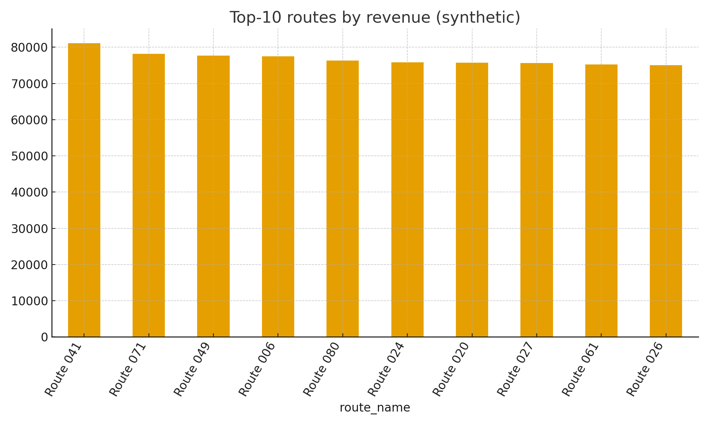
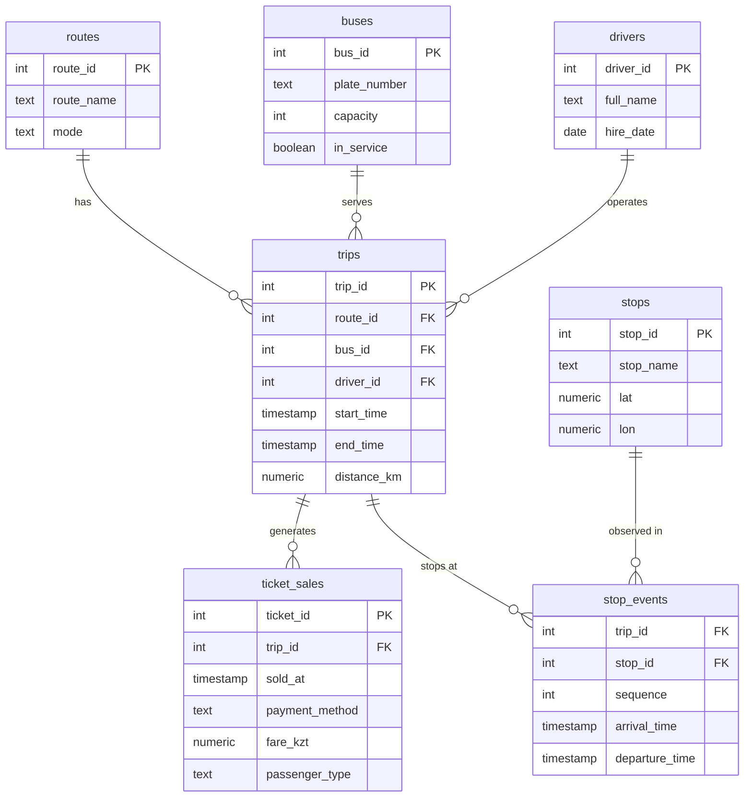

# SmartTransit Astana LLP — Urban Transit Analytics

**Коротко про меня и проект.** Как аналитик данных в *SmartTransit Astana LLP* я веду учебно‑практический проект: смотрю, как реально ездит городской транспорт, где деньги, где узкие места. Проект нацелен на базовые метрики (выручка по маршрутам, пиковые часы, загрузка автобусов) и быстрые запросы, которые потом можно будет перенести в Superset/дашборды.

**Почему такая тема.** Транспортная аналитика — практична и понятна, легко масштабируется, а главное — позволяет показать весь цикл: БД → SQL → Python → графики.

---

## Что внутри репозитория

```
TransitAnalyticsProject/
├─ data/                 # CSV (синтетика): 7 таблиц, 60k+ строк продаж билетов
├─ db/
│   ├─ init.sql          # схема БД (PostgreSQL‑стиль), пойдёт и для SQLite
│   └─ queries.sql       # 10+ SQL запросов по темам
├─ images/
│   └─ overview.png      # скрин с топ‑10 маршрутов по выручке (синтетика)
└─ scripts/
    └─ main.py           # быстрый запуск: создать БД, залить CSV, выполнить SQL, построить график
```

Скриншот для README (можно заменить позже):  


---

## Как запустить за ~15 минут (Zenbook 14 Flip OLED, Windows 11)

**Самый быстрый путь — SQLite + Python (без установки СУБД):**

1. Установите Python 3.11+ (если не установлен).
   - Откройте Microsoft Store → Python 3.11 → Install.  
     Либо скачайте с python.org и поставьте галочку “Add Python to PATH”.

2. Распакуйте архив проекта в удобную папку (например, `C:\Users\<имя>\Projects\TransitAnalyticsProject`).

3. Откройте **PowerShell** в папке проекта:
   - Shift + правый клик по пустому месту → “Open PowerShell window here”.

4. Создайте и активируйте виртуальную среду:
   ```powershell
   python -m venv .venv
   .\.venv\Scripts\Activate.ps1
   ```

5. Установите зависимости:
   ```powershell
   pip install pandas sqlalchemy matplotlib psycopg2-binary
   ```

6. Запустите скрипт (создаст SQLite‑БД, загрузит CSV, выполнит запросы и сохранит график):
   ```powershell
   python .\scripts\main.py
   ```

7. Проверьте результаты в терминале и файл `images/overview.png`. Это ваш минимальный “скрин основной аналитики”.

**Вариант для PostgreSQL (на будущее / для защиты):**

1. Поставьте PostgreSQL (Windows installer). Создайте БД `transitdb`.
2. Импортируйте схему и CSV:
   ```powershell
   psql -U postgres -h localhost -d transitdb -f db\init.sql

   \copy routes      FROM 'data/routes.csv'      WITH (FORMAT csv, HEADER true);
   \copy stops       FROM 'data/stops.csv'       WITH (FORMAT csv, HEADER true);
   \copy buses       FROM 'data/buses.csv'       WITH (FORMAT csv, HEADER true);
   \copy drivers     FROM 'data/drivers.csv'     WITH (FORMAT csv, HEADER true);
   \copy trips       FROM 'data/trips.csv'       WITH (FORMAT csv, HEADER true);
   \copy ticket_sales FROM 'data/ticket_sales.csv' WITH (FORMAT csv, HEADER true);
   \copy stop_events FROM 'data/stop_events.csv' WITH (FORMAT csv, HEADER true);
   ```
3. Выполните запросы:
   ```powershell
   psql -U postgres -h localhost -d transitdb -f db\queries.sql
   ```
4. Чтобы `main.py` подключался к Postgres, установите переменную окружения:
   ```powershell
   setx DATABASE_URL "postgresql+psycopg2://postgres:<пароль>@localhost:5432/transitdb"
   ```
   Перезапустите PowerShell, активируйте venv, снова `python .\scripts\main.py` — теперь график строится из Postgres.

---

## ER‑диаграмма (словами)



- `routes (route_id, route_name, mode)`  
- `stops (stop_id, stop_name, lat, lon)`  
- `buses (bus_id, plate_number, capacity, in_service)`  
- `drivers (driver_id, full_name, hire_date)`  
- `trips (trip_id, route_id → routes, bus_id → buses, driver_id → drivers, start_time, end_time, distance_km)`  
- `ticket_sales (ticket_id, trip_id → trips, sold_at, payment_method, fare_kzt, passenger_type)`  
- `stop_events (trip_id → trips, stop_id → stops, sequence, arrival_time, departure_time)` — PK по (trip_id, stop_id, sequence)

Связи: `routes 1‑N trips`, `buses 1‑N trips`, `drivers 1‑N trips`, `trips 1‑N ticket_sales`, `trips 1‑N stop_events`, `stops 1‑N stop_events`.

---

## Что считать и показывать (мои 10 тем аналитики)
1. Выручка по маршрутам (ticket_sales × trips × routes) — кто в топе.
2. Средняя дистанция рейса по маршрутам — нагрузка/экономика.
3. Сплит оплат (cash/card/qr) — операционные выводы.
4. Пиковые часы продаж — планирование выпуска.
5. Продуктивность водителей: сколько билетов “приходится” на водителя.
6. Средняя загрузка автобусов (приближенно: билеты/вместимость).
7. Рейсы и продажи за последнюю неделю — динамика.
8. Самые “сложные” остановки по количеству событий.
9. Revenue MTD топ‑10 маршрутов — “витрина” для дашборда.
10. Базовые выборки для контроля качества данных (LIMIT, WHERE, ORDER BY).

Все SQL — в `db/queries.sql` (короткие комментарии внутри).

---

## Для README по заданию (как просили)
- **Название “компании”:** SmartTransit Astana LLP  
- **Кратко о проекте:** учебно‑практическая аналитика городских перевозок (синтетические данные).  
- **Скриншот основной аналитики:** `images/overview.png` (позже заменю на реальный дашборд Superset).  
- **Как запустить:** см. разделы выше (SQLite за 15 минут; Postgres — опционально).  
- **Инструменты:** Python, Pandas, SQLAlchemy, Matplotlib; (опционально) PostgreSQL; (позже) Apache Superset.

---

## План на следующие задания
1. Перенести ключевые запросы в Superset и собрать 2–3 чарта.  
2. Сформировать витрины (views) для стабильных метрик.  
3. Добавить тесты целостности (NOT NULL, ключи, базовые проверки).  
4. Докрутить README и добавить новые скрины.
