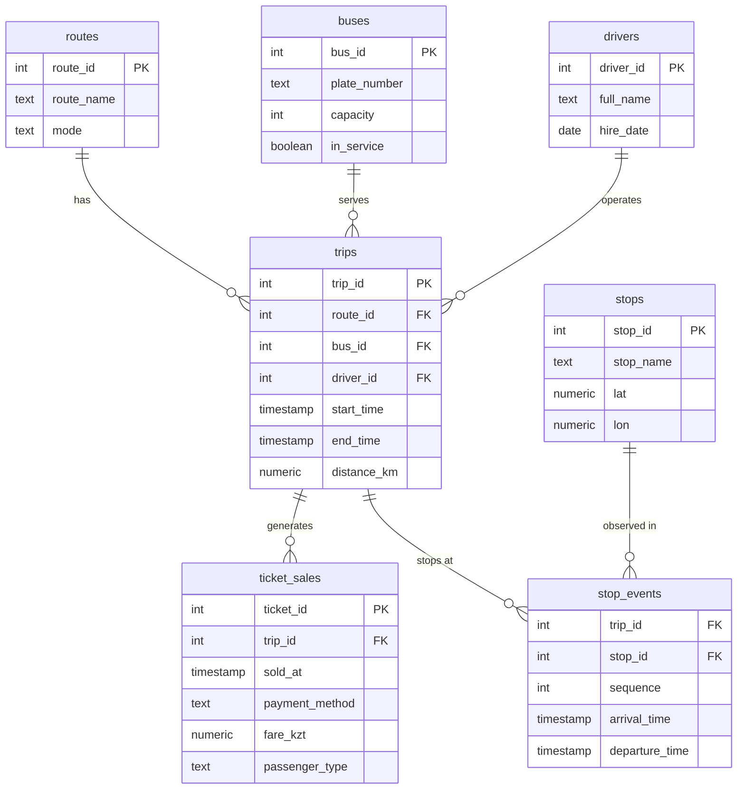

# SmartTransit Astana LLP — Urban Transit Analytics


---

## Что внутри репозитория

```
TransitAnalyticsProject/
├─ data/                 # CSV (синтетика): 7 таблиц, 60k+ строк продаж билетов
├─ db/
│   ├─ init.sql          # схема БД (PostgreSQL‑стиль), пойдёт и для SQLite
│   └─ queries.sql       # 10+ SQL запросов по темам
├─ images/
│   └─ overview.png      # скрин с топ‑10 маршрутов по выручке (синтетика)
└─ scripts/
    └─ main.py           # быстрый запуск: создать БД, залить CSV, выполнить SQL, построить график
```

## ER‑диаграмма (словами)



- `routes (route_id, route_name, mode)`  
- `stops (stop_id, stop_name, lat, lon)`  
- `buses (bus_id, plate_number, capacity, in_service)`  
- `drivers (driver_id, full_name, hire_date)`  
- `trips (trip_id, route_id → routes, bus_id → buses, driver_id → drivers, start_time, end_time, distance_km)`  
- `ticket_sales (ticket_id, trip_id → trips, sold_at, payment_method, fare_kzt, passenger_type)`  
- `stop_events (trip_id → trips, stop_id → stops, sequence, arrival_time, departure_time)` — PK по (trip_id, stop_id, sequence)

Связи: `routes 1‑N trips`, `buses 1‑N trips`, `drivers 1‑N trips`, `trips 1‑N ticket_sales`, `trips 1‑N stop_events`, `stops 1‑N stop_events`.

\
